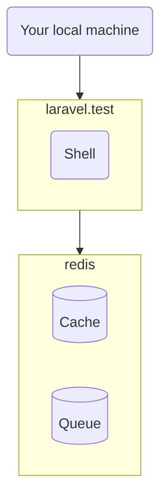

# Open Weather Map - Whatagraph integration

* [Introduction](#introduction)
* [Usage](#usage)
* [Local installation](#local-installation)
    * [Docker](#docker)
    * [Prerequisites](#prerequisites)
    * [Installation](#installation)
* [How it works](#how-it-works)

## Introduction

This project pulls data from [One Call API 3.0](https://openweathermap.org/api/one-call-3) weather API for specified locations via a Geocoding API, and then pushes the data back into the [Whatagraph API](https://api.whatagraph.com/public-api/index.html) via a RESTful API.

## Local installation

### Docker

Consider using Docker:

As you can see in the `docker-compose.yml`, it uses 2 containers:

* `laravel.test` container runs PHP code - CLI commands.
* `redis` container stores the cache and the job queue.

### Prerequisites

Before installing the project:

* Install
    * PHP 8.1
    * Composer
    * Node.js
    * Docker 2
    * Docker Compose
* [Create the `sail` shell alias](https://laravel.com/docs/9.x/sail#configuring-a-shell-alias).
* Create an [Open Weather Map](https://openweathermap.org/) account and subscribe to the "One Call by Call" plan.
* Create a Whatagraph account, create new "Custom API" source and name it "Weather".

### Installation

Install the project into the `~/projects/whatagraph-challenge` directory (the "project directory"):

1. Download and prepare the project files using the following commands:

        cd ~/projects
        git clone git@github.com:osmianski/whatagraph-challenge.git
        cd whatagraph-challenge
        composer install
        php -r "file_exists('.env') || copy('.env.example', '.env');"
        php artisan key:generate --ansi

2. In a separate terminal window, start the Docker containers by running the following commands, and keeping it running there:

        cd ~/projects/whatagraph-challenge
        sail up

3. In the `.env` file, add API keys from the Open Weather Map account and Whatagraph custom API definition, respectively:

        # Connect to https://openweathermap.org/api
        WEATHER_API_KEY=

        # Connect to https://api.whatagraph.com
        WHATAGRAPH_API_KEY=

4. Specify one or more locations to fetch weather data for in the `config/locations.php` file. Use exact street addresses, or just cities:

        return [
            'Vilnius',
        ];
 
5. Push data to Whatagraph: 

        cd ~/projects/whatagraph-challenge
        
        # Configure dimensions and metrics. optionally, use --fresh option 
        # to clear existing Whatagraph data  
        sail artisan whatagraph:init
        
        # Read weather data and push it to Whatagraph 
        sail artisan whatagraph:push

6. Visualize weather data in Whatagraph reports.

## How it works
