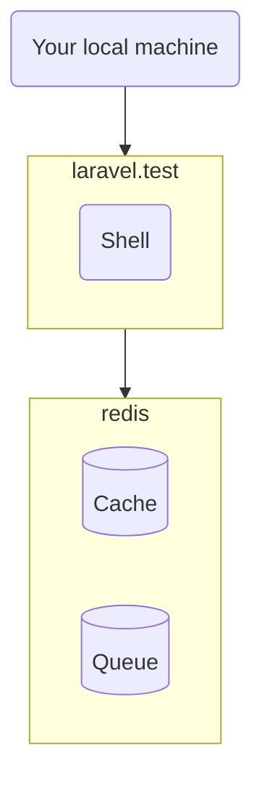

# Open Weather Map - Whatagraph integration

* [Introduction](#introduction)
* [Local installation](#local-installation)
    * [Docker](#docker)
    * [Prerequisites](#prerequisites)
    * [Installation](#installation)
    * [Tests](#tests)
* [How it works](#how-it-works)
    * [Whatagraph API](#whatagraph-api)
    * [Weather API](#weather-api)
    * [`whatagraph:init` command](#whatagraphinit-command)
    * [`whatagraph:push` command](#whatagraphpush-command)
    * [`PushLocation` job](#pushlocation-job)
    * [Schedule](#schedule)
    * [Retry strategy](#retry-strategy)

## Introduction

This project pulls data from [One Call API 3.0](https://openweathermap.org/api/one-call-3) weather API for specified locations via a Geocoding API, and then pushes the data back into the [Whatagraph API](https://api.whatagraph.com/public-api/index.html) via a RESTful API.

## Local installation

### Docker

Consider using Docker:



As you can see in the `docker-compose.yml`, it uses 2 containers:

* `laravel.test` container runs PHP code - CLI commands.
* `redis` container stores the cache and the job queue.

### Prerequisites

Before installing the project:

* Install
    * PHP 8.2
    * Composer
    * Node.js
    * Docker 2
    * Docker Compose
* [Create the `sail` shell alias](https://laravel.com/docs/9.x/sail#configuring-a-shell-alias).
* Create an [Open Weather Map](https://openweathermap.org/) account and subscribe to the "One Call by Call" plan.
* Create a Whatagraph account, create new "Custom API" source and name it "Weather".

### Installation

Install the project into the `~/projects/whatagraph-challenge` directory (the "project directory"):

1. Download and prepare the project files using the following commands:

        cd ~/projects
        git clone git@github.com:osmianski/whatagraph-challenge.git
        cd whatagraph-challenge
        composer install
        php -r "file_exists('.env') || copy('.env.example', '.env');"
        php artisan key:generate --ansi

2. In a separate terminal window, start the Docker containers by running the following commands, and keeping it running there:

        cd ~/projects/whatagraph-challenge
        sail up

3. In the `.env` file, add API keys from the Open Weather Map account and Whatagraph custom API definition, respectively:

        # Connect to https://openweathermap.org/api
        WEATHER_API_KEY=

        # Connect to https://api.whatagraph.com
        WHATAGRAPH_API_KEY=

4. Specify one or more locations to fetch weather data for in the `config/locations.php` file. Use exact street addresses, or just cities:

        return [
            'Vilnius',
        ];
 
5. Push data to Whatagraph: 

        cd ~/projects/whatagraph-challenge
        
        # Configure dimensions and metrics. optionally, use --fresh option 
        # to clear existing Whatagraph data  
        sail artisan whatagraph:init
        
        # Read weather data and push it to Whatagraph 
        sail artisan whatagraph:push

6. Visualize weather data in Whatagraph reports.

### Tests

This project uses Pest. To run tests, use the following command:

    sail test

Test coverage is intentionally limited due to lack of time. In addition to the integration logic covered in the `tests/Feature/IntegrationTest.php` file, here are some more ideas for testing:

* Test how `App\Whatagraph` and `App\Weather` namespaces translate the PHP API calls into the HTTP calls, and responses back to PHP call results.
* Test more edge cases in the integration logic.
* Test that the external service interfaces don't change unnoticed. 

## How it works

### Whatagraph API

The `App\Whatagraph\Whatagraph` class, and other classes in the `App\Whatagraph` namespace, provide a convenient object model for making Whatagraph API calls.

Example:

```php
// Create a connection object. Provide the API key explicitly, or use the one from
// `.env` file
$whatagraph = new Whatagraph('api_key');

// Create one or more metrics
$metric = new Metric();
...
$whatagraph->createMetric($metric);

// Create one or more dimensions
$dimension = new Dimension();
...
$whatagraph->createDimension($dimension);

// Push data points. Batch multiple data points into a single call for better
// performance
$whatagraph->createDataPoints([
    DataPoint::new(now(), [
        ...
    ]),
    ...
]);
```

### Weather API

The `App\Weather\Weather` class, and other classes in the `App\Weather` namespace, provide a convenient object model for making Whather API calls.

Example:

```php
// Create a connection object. Provide the API key explicitly, or use the one from
// `.env` file
$weather = new Weather('api_key');

// Convert an address string to geographic coordinates
$coords = $weather->getGeoCoords('Vilnius');

// Retrieve weather data for the geographic coordinates
$weatherInfo = $weather->getInfo($coords->latitude, $coords->longitude);
```

### `whatagraph:init` command

This command reads configuration of Whatagraph metrics and dimensions from the `config/whatagraph.php` file, and intelligently creates/updates/deletes these definitions on Whatagraph server. The configuration file is straightforward:

```php
return [
    'api_key' => env('WHATAGRAPH_API_KEY'),

    'dimensions' => [
        'location' => [
            'title' => 'Location',
            'type' => Dimension\Type::String_,
        ],
    ],

    'metrics' => [
        'day_temperature' => [
            'title' => 'Day Temperature',
            'type' => Metric\Type::Float_,
            'accumulator' => Metric\Accumulator::Average,
            'negative_ratio' => false,
        ],
        ...
    ],
];
```

There are two types of metrics - real-life metrics (`day_temperature`, `humidity`) and their forecasts (`day_temperature_forecast`, `humidity_forecast`). 

The additional `whatagraph:init --fresh` option deletes all previously uploaded data points fromthe Whatagraph server. 

### `whatagraph:push` command

For every location specified in the `config/locations.php` file, this command dispatches a queued job, `PushLocation`, that pushes the weather data of the location. The `config/locations.php` file is just an array of location addresses:

```php
return [
    'Vilnius',
];
```

The additional `--current` option, if present, makes the `PushLocation` to only push the current weather, and skip the forecasts.

### `PushLocation` job

The job logic is pretty much self-descriptive:

```php
public function handle(): void
{
    $info = $this->getInfo();

    $this->prepareCurrent($info->current);

    if ($this->forecast) {
        foreach ($info->forecasts as $forecast) {
            if (!$this->isTodayForecast($forecast, $info)) {
                $this->prepareForecast($forecast);
            }
        }
    }

    $this->pushDataPoints();
}
```

In the `getInfo()` method, it gets the geographic coordinates of specified location address, and fetches the weather information into the `$info` variable.

Then, it prepares an array of data points to be pushed to Whatagraph in two steps:

1. The `prepareCurrent()` method adds today's data point filled in with real-life data. Day/night temperatures are only added if the job is executed at day or night, respectfully.
2. The `prepareForecast()` method adds a data point in the near future, up to 8 days ahead, filled in with forecast data.
 
Finally, the `pushDataPoints()` method pushes the prepared data points. New data points are pushed in a single API call using the `Whatagraph::createDataPoints()` method, while the data points sent earlier are updated one at a time using the `Whatagraph::updateDataPoint()` method. 

### Using cache

For better performance, the `PushLocation` job uses cache. It remembers:

1. `coords:{$location}` keys - geographic coordinates of specified location address.
2. `id:{$location},{$date}` keys - Whatagraph IDs of all data points sent earlier.

The `id:...` cache entries are tagged with the `id` tag. It's used in the `whatagraph:init --fresh` command to forget all the IDs of cleared data points:

```php
Cache::tags('id')->flush();
```

### Schedule

In production, the `whatagraph:push` command is scheduled to run twice a day in the `App\Console\Kernel::schedule()` method:

```php
$schedule->command('whatagraph:push')
    ->dailyAt('02:00');
$schedule->command('whatagraph:push --current')
    ->dailyAt('14:00');
```

At night, it pushes both the actual night data and the forecasts. At day, it only pushes the actual day data.

### Retry strategy

In production, use asynchronous queue (for example, stored in Redis). It will enable the `PushLocation` command to retry itself in case of failure of the APIs:

```php
class PushLocation implements ShouldQueue, ShouldBeUnique
{
    use Dispatchable, InteractsWithQueue, Queueable, SerializesModels;

    /**
     * The number of times the job may be attempted.
     *
     * @var int
     */
    public int $tries = 10;

    /**
     * The number of seconds to wait before retrying the job.
     *
     * @var int
     */
    public int $backoff = 60 * 30; // 30 minutes

    ...
}
```
